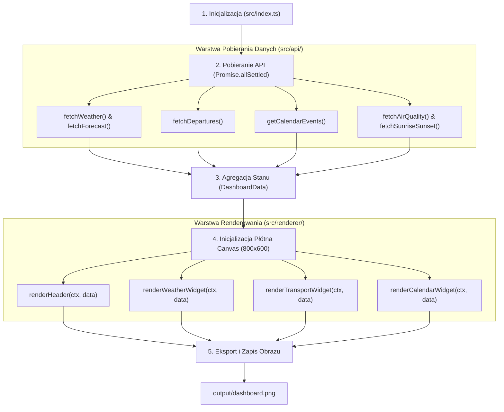

# Przepływ Danych (Data Flow Architecture)

Opis przepływu danych w aplikacji `info-panel` dla wyświetlacza E-Ink – od pobierania danych z zewnętrznych usług API, przez agregację stanu, po renderowanie widżetów na płótnie Canvas i zapis pliku graficznego.

---

## 1. Schemat Ogólny Przepływu



---

## 2. Opis Kroków w Architekturze

### Krok 1: Inicjalizacja (`src/index.ts`)
Główny punkt startowy aplikacji (Orchestrator). Uruchamia proces pobierania danych oraz zarządza cyklem życia renderowania.

### Krok 2: Warstwa API (`src/api/*`)
Równoległe pobieranie danych z zewnętrznych usług za pomocą `Promise.allSettled`:
* **Pogoda i Prognoza:** IMGW / Open-Meteo (`weather.ts`)
* **Komunikacja Miejska:** ZDiTM Szczecin (`transport.ts`)
* **Kalendarz:** Google Calendar API (`calendar.ts`)
* **Jakość Powietrza i Słońce:** GIOŚ (`airQuality.ts`) & Czas Wschodu/Zachodu (`sun.ts`)

Błędy poszczególnych usług są przechwytywane lokalnie i zwracają `null`, zapewniając, że awaria jednego API nie przerywa działania całej aplikacji.

### Krok 3: Agregacja Stanu (`src/types/dashboard.ts`)
Wyniki z poszczególnych API są składane w jeden spójny obiekt typu `DashboardData`:
```typescript
interface DashboardData {
    weather: WeatherData | null;
    forecast: HourlyForecastItem[] | null;
    departures: TramDepartureData[] | null;
    calendar: CalendarEvent[] | null;
    airQuality: AirQualityData | null;
    sun: SunriseData | null;
    updatedAt: string;
}
```

### Krok 4: Renderowanie i Widżety (`src/renderer/*`)
Obiekt `DashboardData` jest przekazywany do menedżera Canvas (`canvas.ts`), który inicjalizuje płótno $800 \times 600$ px i deleguje rysowanie poszczególnych sekcji do komponentów widżetów:
* **`components/header.ts`**: Zegar, data i znacznik aktualizacji.
* **`components/weatherWidget.ts`**: Temperatura, opady, jakość powietrza i wschód/zachód słońca.
* **`components/transportWidget.ts`**: Lista najbliższych odjazdów autobusów/tramwajów.
* **`components/calendarWidget.ts`**: Nadchodzące wydarzenia i zadania z kalendarza.

W widżetach wykonywane jest ewentualne dynamiczne formatowanie (np. przeliczanie minut do odjazdu lub formatowanie czasów).

### Krok 5: Eksport Obrazu (`output/dashboard.png`)
Gotowe płótno z czarno-białą grafiką o wysokim kontraście jest zapisywane do pliku `output/dashboard.png`, skąd może być pobrane przez czytnik E-Ink (Nook).
